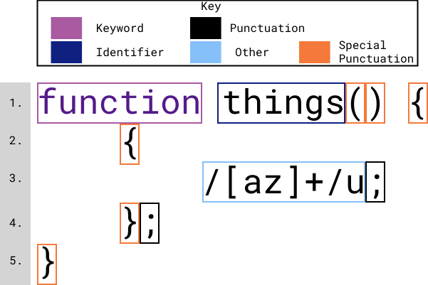
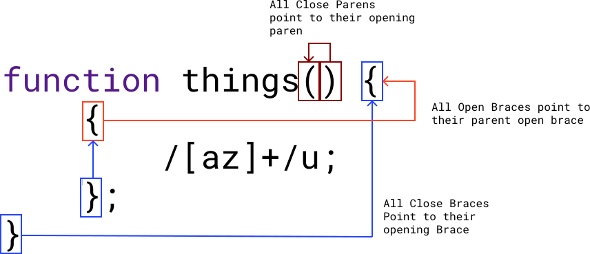
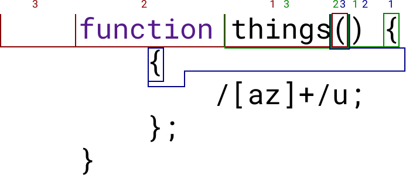

# Regex Detection at Tokenization
This library implements an algorithm to detect if any give forward slash is the beginning of a regular expression literal or should be considered a single forward slash (originally developed by the [sweet.js team](https://github.com/sweet-js/sweet-core/)). This may seem like a strange thing to need to do but the ecma script spec allows for some crazy things regarding division, for example:

```js
let x = {} / 100;
//x == NaN
let y = function() {} / 100;
//y == NaN
{}/1/g //this is actually a regular expression!
```

While most sane JS programmers wouldn't perform the above, it means that we need to look backwards to know if any forward slash might be a regular expression. Keeping a history of tokens is a bit problematic, depending on how long that history needs to be. In this case we may need to look back an arbitrary number of tokens to get the right answer, keeping all of the tokens around indefinitely is pretty expensive. Even if we were to pair down the data to an un-nested enum that would be 1 bytes per token, the library jquery has a total of `46_863` tokens which would be `~45kb`. Add to the overall size and number of allocations the fact that we would need to scan backwards an unknown distance, touching each index, makes this solution less than ideal. So how can we get to a solution? Well, let's take a look at the [sweet.js "read" algorithm](https://github.com/sweet-js/sweet-core/wiki/design).

Initially reading their "almost-one lookbehind" description can be slightly confusing, [they published a paper](https://users.soe.ucsc.edu/~cormac/papers/dls14a.pdf) that details a method for creating "token-trees", the paper goes into much greater detail about what a "token-tree" is but to give you the short version of how it relates to the linked psuedo-code:

- `{}` and `()` are considered one token but represent the full stream between the open and close
- `tok-#` is referring to these "token-trees" not tokens themselves
  - so in `function(n) {} /`, `tok-2` is `)` and `tok-3` is `function`
- The `isBlock` helper function also requires that any `{}` can access a possible parent `{}`
  - so in `{function() {}}` the function body start needs to be able to see the block start at the very beginning

Now let's rephrase the algorithm in plain english.
- if the current token is a `/`, look back one token
- if the previous token is `)`
  - if the token before it's opening paren is `if`, `while`, `for`, or `with`, we found a regex
  - else, we found a forward slash
- if the previous token is `}`
  - we check if it is a block by looking 1 before it's opening
    - if that is `(` or `[` it is not a block
    - if that is `:` we look to the opening's parent
      - if no parent, it is a block
      - else if the parent is a block, it is a block
      - else, it is not a block
    - if that is a punctuation or keyword that represents an operation (see below), it is not a block
    - if that is the keyword `return` or `yield`
      - check the line number of the open brace and one token before the open brace
        - if they match, it is not a block
        - else, it is a block
    - if that is the keyword `case`, it is not a block
    - else, it is a block
  - if it is a block
    - we look to the token behind the `{`
      - if that is a `)`
        - we check if the token 1 or 2 before the `(` is  the keyword `function`, we need to check if that is an expression
          - if it is
            - if the token before `function` is `(`, `[`, punctuation or keyword that represents an operation (see below), or the keyword `case` or `return`, we found a forward slash
            - else, we found a regex
          - else, we found a regex
      - else, we found a regex
  - else, we found a forward slash
- if the previous token is any other punctuation, we found a regex
- if the previous token is a keyword but not `this`, we found a regex
- else, we found a forward slash

> punctuation or keyword that represents an operation:
>
> `=`, `+=`, `-=`, `*=`, `/=`, `%=`, `<<=`, `>>=`, `>>>=`, `&=`, `|=`, `^=`, `,`, `+`, `-`, `*`, `/`, `%`, `<<`, `>>`, `>>>`, `&`, `|`, `^`, `&&`, `||`, `?`, `:`, 
`instanceof`, `in`, `===`, `==`, `>=`, `<=`, `<`, `>`, `!=`, `!==`, `++`, `--`, `~`, `!`, `delete`, `void`, `typeof`, `throw`, `new`

With that in mind, let's look at an example:

<div style="padding-top: 5px; background:white;">
    
</div>

As you can see, each of the tokens has a type, the key describes how we think about tokens when checking for a regular expression. There are 4 types of token we care about the rest get lumped into `other`, we can refer to this set as `MetaToken`. Because of how the `isBlock` works, we need each of these to know what line it was on, so all of the `MetaToken`s will carry their line number. Looking through the above description of our algorithm, the furthest we need to look backwards from an `{` is 3 tokens, so our scanner should always keep track of the last 3 tokens we have seen.


~The above button will animate our illustration to help visualize what the look behind would look like. Each arrow points to one of the tokens we need to keep track of.~ You may have noticed that one of the variants of `MetaToken` is "special punctuation", this is because we need to treat `(`, `)`, `{`, and `}` in a special way.

Using the same example, this is what special means:
<div style="padding: 5px;background: white;">
    
</div>
Every `)` or `}` needs to point to the tokens before it's paired `(` or `{` and every `{` needs to point to a parent `{` if one exists. In addition both the `(` and `{` need to point to the 3 tokens before them, which might look something like this:

<div style="padding: 5px;background: white;">
    
</div>
First we encounter the red opening paren, it would need to hold the `things` ident at position 1 and `function` keyword at position 2, position 3 would be empty. Next we would encounter the green open curly brace, this would hold the close paren at 1, red open paren at 2 and `things` at 3. Finally we would encounter the blue open curly brace, this would hold the green curly brace at 1, the close paren at 2 and the red open paren at 3.